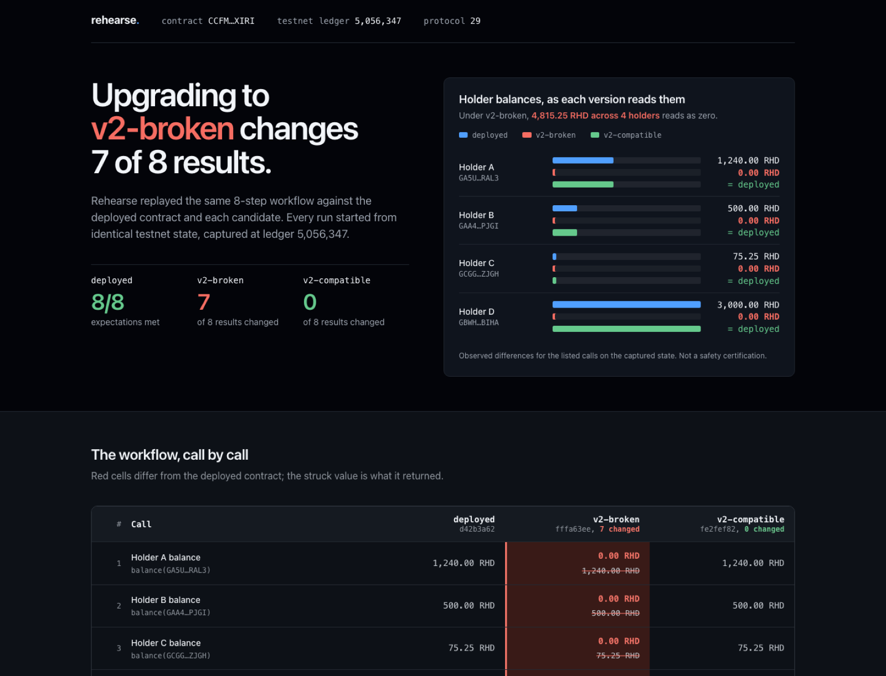

# Rehearse

Replay a Soroban contract's real workflow against candidate Wasm, on ledger state captured from the network, before you upgrade.



An upgrade keeps the contract address and every stored entry, and swaps only the code. Unit tests start from an empty ledger, so they never see the state your holders actually have. Rehearse does:

1. **Capture** the ledger entries a workflow touches, all read at one ledger.
2. **Replay** the same calls offline: once with the deployed code, once with each candidate, each run in its own copy of that state.
3. **Report** every call whose return value differs and every storage entry that ends differently, as JSON and as a single offline HTML page.

What it tells you is narrow on purpose: *the observed differences for the calls you listed, on the state you captured.* It is not a safety certification, and a clean report does not mean an upgrade is safe.

## The demo

`demo/` holds a small SEP-41-style token deployed on testnet with four seeded holders, plus two candidate upgrades:

| Build | Change | Its own unit tests | Contract spec vs v1 | Rehearse on captured state |
|---|---|---|---|---|
| `token-v2-compatible` | Refactors balance reads/writes into helpers | 8 of 8 pass | byte-identical | no observed difference |
| `token-v2-broken` | Renames the storage key `DataKey::Balance` to `DataKey::BalanceOf` | 8 of 8 pass | byte-identical | **7 of 8 results change**: every holder reads 0, and a transfer fails with `InsufficientBalance` |

The broken build gets past the checks most teams run before an upgrade. Its tests write and read through the renamed key, so they pass. SDK 28 strips storage-only types from the contract spec, so a spec diff shows nothing. Only replaying against the state v1 actually wrote shows that the balances are still on-chain under `Balance(…)`, while v2 reads `BalanceOf(…)` keys that hold nothing.

One caveat: the variant names still appear as plain strings in the Wasm data section. The rename is invisible to a spec diff, not to every possible static check.

Open [`demo/report.html`](demo/report.html) to see the full report.

## On a contract we didn't write

[`examples/blend-pool`](examples/blend-pool) runs Rehearse read-only against Blend's testnet lending pool, a production protocol built with soroban-sdk 22. Its deployed code is byte-identical to Blend's published v2.0.0 release. Two builds from Blend's own history were replayed as candidates: v2.0.0 rebuilt from source, and the commit before their flash-loan fix. All five pool reads were identical across all three versions, with nothing read outside the capture. The offline baseline also matched the live network, except for interest that accrues with time. That example is also why the comparison is narrow: the fix only touches flash loans, which those reads never exercise.

## Reproduce it

Everything needed to regenerate the demo report is committed: the captured snapshot, the three Wasm builds and the manifest. Replay makes no network calls.

```sh
./reproduce.sh                    # builds the CLI, replays, checks both reports match byte for byte
OFFLINE=1 ./reproduce.sh          # same, using only the local crate cache
```

Or on a clean machine with Docker:

```sh
docker build -t rehearse .
docker run --rm --network none rehearse
```

## Use it on your contract

Build the CLI (tested with Rust 1.95). The binary lands at `cli/target/release/rehearse`.

```sh
cargo build --release --manifest-path cli/Cargo.toml
```

Write a manifest listing the calls that matter to your holders, in order. Arguments are typed. `expect` is optional and is checked against the deployed code. `display` is optional and only affects how amounts are formatted.

```json
{
  "description": "Read two holders, move funds, read again.",
  "network": "testnet",
  "rpc": "https://soroban-testnet.stellar.org",
  "contract": "C…",
  "display": { "decimals": 7, "symbol": "RHD", "amount_calls": ["balance"] },
  "steps": [
    { "label": "holder A balance", "call": "balance", "args": [{ "address": "G…" }], "expect": "12400000000" },
    { "label": "A sends 100 to B", "call": "transfer",
      "args": [{ "address": "G…" }, { "address": "G…" }, { "i128": "1000000000" }] }
  ]
}
```

Supported argument types: `address`, `i128`, `u32`, `string`, `bool`.

Then capture once, and replay as often as you like:

```sh
# Simulates the workflow on the network to learn which keys it touches, then fetches them.
# --source is any funded account; nothing is signed or submitted.
rehearse capture --manifest manifest.json --source G… --out capture \
  --candidate v2=path/to/candidate.wasm

# Offline from here on.
rehearse replay --manifest manifest.json --capture capture \
  --candidate v2=path/to/candidate.wasm --out report.json [--fail-on-divergence]
rehearse render --report report.json --out report.html
```

### In CI

`replay --fail-on-divergence` exits **2** when any candidate differs from the deployed contract (or reads state outside the capture), **0** when none do, and **1** on errors. [`.github/workflows/upgrade-check.yml`](.github/workflows/upgrade-check.yml) uses it to block a pull request whose proposed upgrade, `demo/upgrade/candidate.wasm`, changes what the workflow observes. It writes a per-step table to the job summary and attaches the HTML report. To use it in your own repo, copy the file and point it at your manifest, committed capture and built Wasm.

### How capture decides what to save

1. Every manifest step is simulated on the live network with `simulateTransaction`. The union of the returned footprints is the starting key set.
2. All keys are fetched in a single `getLedgerEntries` call, so every entry, and every confirmed absence, comes from the same ledger.
3. The deployed code and each candidate are replayed locally against that snapshot. Any key a candidate reads that was not captured is added, and step 2 repeats until nothing new appears.

So when a candidate reads a value, it is either real captured state or a key confirmed absent at the capture ledger. The report lists any reads outside the capture. In the demo there are none, and broken v2's four `BalanceOf(…)` keys are confirmed absent on testnet.

## Scope and limits

- **Runtime.** `soroban-sdk` 28.0.0 and `soroban-env-host` 28.0.2 with the experimental `next` feature, which runs protocol-29 state. This is close to production behaviour but not exact protocol-29 parity. Tested with contracts built by soroban-sdk 28. State-archival settings in the snapshot use SDK defaults, not the network's.
- **Authorization is mocked.** Every `require_auth` is satisfied and signatures are not checked, so the report says nothing about authorization behaviour.
- **Code replacement, not the upgrade path.** The candidate is installed directly under the contract address. Your contract's own `upgrade` entrypoint and any migration logic are not exercised.
- **Only what you list.** Calls not in the manifest, events, and fee and resource costs are not compared.
- **Cross-contract calls.** Contracts your workflow calls are captured through the same footprint and execute during replay, but only along the paths these runs took. The demo does not exercise cross-contract calls.
- **One ledger.** A capture is a point-in-time copy. Recapture before relying on an old report.

## Related tools

Rehearse builds on ideas that already exist, and credits them:

- [**soroban-fork**](https://github.com/lobotomoe/soroban-fork) is a lazy-loading fork of mainnet or testnet for Soroban tests. Its `fork_etch` swaps the Wasm under an address while keeping storage, which is the same mechanism Rehearse uses for candidates. As of October 6, 2026, its latest release (0.9.5, `soroban-env-host` 25) caps forks to protocol 25. It refuses contracts built with soroban-sdk 28 (`contract protocol number is newer than host`), and SDK 26–27 builds fail the same check by their declared protocol. A host upgrade on its side would close that gap. Rehearse's contribution is the workflow: a declarative manifest, a converging capture, independent branches per candidate, and a reviewable report with explicit coverage.
- [**Soroban Upgrade Safeguard**](https://github.com/ShippedLabs/soroban-upgrade-safeguard) (ShippedLabs) is a static compatibility checker for interfaces, storage layout and events, with an empirical mode that checks whether captured storage still decodes under the new spec. It inspects structure; Rehearse executes code. As of October 6, 2026, its decoders cover protocols 20–23, so it could not analyse the SDK 28 demo builds.
- The Stellar docs on [fork testing](https://developers.stellar.org/docs/build/guides/testing/fork-testing) and [differential testing](https://developers.stellar.org/docs/build/guides/testing/differential-tests) describe the manual version of this technique.

## Repository layout

```
cli/              the rehearse CLI (capture, replay, render)
demo/contracts/   token v1, v2-compatible and v2-broken, with one shared test suite
demo/wasm/        the three built Wasm files
demo/capture/     captured testnet snapshot and provenance (ledger 5,056,347)
demo/report.*     the demo report, as JSON and HTML
reproduce.sh      offline, byte-for-byte reproduction check
Dockerfile        the same check on a clean machine
.github/          CI (reproduction + exit codes) and the pull-request upgrade check
demo/upgrade/     the proposed upgrade the pull-request check replays
examples/         real-world runs (Blend's testnet pool)
GATES.md          validation log: what was tested, how, and the results
```

## License

Apache License 2.0. See [LICENSE](LICENSE).
